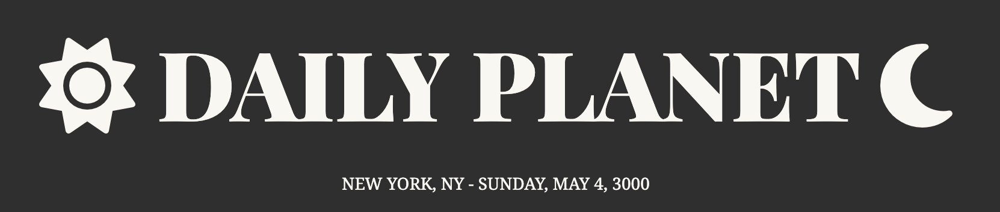
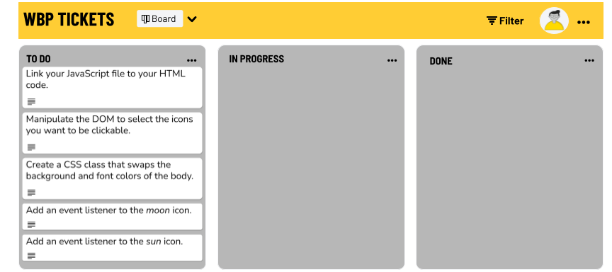

# DOM Events

You work for the Daily Planet, an astrology site that recently gained popularity after being featured in a TikTok influencer's morning routine. This influx of traffic has inspired your team to expedite some UX updates that have been sitting on the kanban board for awhile. You've been tasked with adding a user-activated dark mode.

User Stories:
- _As a user, I want to click on the moon icon to change the page to "dark mode" (swap the background and font colors) If the page is already in dark mode, clicking the moon should do nothing._
- _As a user, I want to click on the sun icon to change the page back to "light mode" (original background and font colors). If it is already in light mode, no change._

See screenshot example below:

---

- Link your JavaScript file to your HTML code.
- Manipulate the DOM to select the icons you want to be clickable. (_sun_ & _moon_)
- Create a CSS class that swaps the background and font colors of the body.
- Add an event listener to the _moon_ icon
- Add an event listener to the _sun_ icon. 

---

---

### Preparation Steps

Please concentrate your efforts within the "src" folder, as it will serve as your designated working directory for this exercise. It is important to note that no changes need to be made to any files within the util folder in order to successfully complete the task.

- Fork and clone [this](https://git.generalassemb.ly/SEI-Standard-Curriculum/M1L9-dom-events-starter-code) repo.
- Run the code using VS Code `live server` or by opening the `.html` file in your browser.
- Take a look at the **mock up** [solution demo](https://pages.git.generalassemb.ly/taylor-darneille/dom-events-solution/). (Ignore the horizontal lines that appear under the icons on hover for now. You will have the option of creating those later in the **Stretch Goals** section)

---
### Step 1

- If you haven't noticed yet, the javascript isn't linked to the html yet! Throw a `script` tag at the bottom of the body or use the `defer` attribute and put it in the `head`. Make sure it goes below the font awesome `script` tag that is already present in the `head`

---
### Step 2

- Use `querySelector` or `querySelectorAll` to select the icons you want to be clickable and store them in variables. 
-`console.log` your variables to make sure this worked as expected.

---
### Step 3

- Create a class in css that swaps the background and font colors of the body.

---
### Step 4

- Add a `click` event listener to the moon icon that adds the new class to the body. Keep in mind that the user may click the moon several times - how can you ensure there is only ever one instance of the dark mode class name on the icon?

---
### Step 5

- Add a `click` event listener to the sun icon that removes any and all existing classes from the body.

You will know your code is working when the page can toggle between dark mode and light mode by clicking on the sun and moon icons. 

---
## Stretch Goals (optional)

Use Javascript to add a horizontal line under icons _when the mouse is hovering over them_.

### Step 1

- Add a `mouseenter` event listener to the sun icon that adds a 3px solid bottom border to the icon.

### Step 2

- Add a `mouseout` event listener to the sun icon that resets the `borderBottom` style back to an empty string.

### Step 3

- Repeat steps 1 and 2 for the moon icon.

_Solution code is available in the util folder, should you find yourself stuck._
